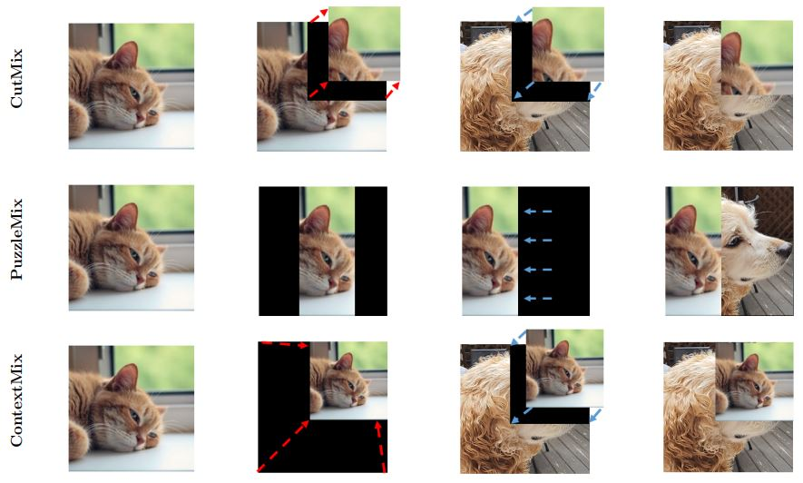

# ContextMix


Official PyTorch implementation of Engineering Applications of Artificial Intelligence (EAAI) paper

[**ContextMix: A context-aware data augmentation method for industrial visual inspection systems**](https://doi.org/10.1016/j.engappai.2023.107842).

## Requirements
- Python3
- PyTorch (> 1.0)
- NumPy
- tqdm

## Train Examples
- CIFAR-100: We used 2 GPUs to train CIFAR-100.
```
python train.py \
--net_type pyramidnet \
--dataset cifar100 \
--depth 200 \
--alpha 240 \
--batch_size 64 \
--lr 0.25 \
--expname PyraNet200 \
--epochs 300 \
--beta 1.0 \
--mix_prob 0.5 \
--no-verbose
```
- ImageNet: We used 4 GPUs to train ImageNet.
```
python train.py \
--net_type resnet \
--dataset imagenet \
--batch_size 256 \
--lr 0.1 \
--depth 50 \
--epochs 300 \
--expname ResNet50 \
-j 40 \
--beta 1.0 \
--mix_prob 1.0 \
--no-verbose
```

## Acknowledgements
Our code is modified and adapted on these great repositories:

- [CutMix: Regularization Strategy to Train Strong Classifiers with Localizable Features](https://github.com/clovaai/CutMix-PyTorch)


## Citation
If you use this method or this code in your research, please cite as:
```
@article{KIM2024107842,
      title = {ContextMix: A context-aware data augmentation method for industrial visual inspection systems},
      journal = {Engineering Applications of Artificial Intelligence},
      volume = {131},
      pages = {107842},
      year = {2024},
      issn = {0952-1976},
      doi = {https://doi.org/10.1016/j.engappai.2023.107842},
      url = {https://www.sciencedirect.com/science/article/pii/S0952197623020262},
      author = {Hyungmin Kim and Donghun Kim and Pyunghwan Ahn and Sungho Suh and Hansang Cho and Junmo Kim}
   }
```

## License
This project is licensed under the MIT License - see the [LICENSE](LICENSE) file for details.
